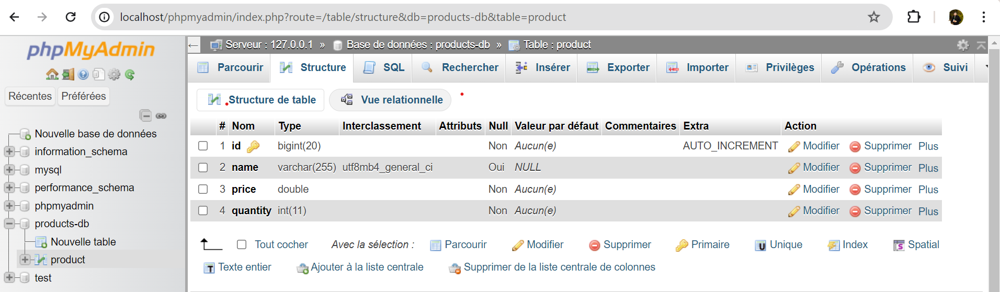

<h3>COMPTE RENDU</h3>
<h2>Structure du projet</h2>

<h2>Création de  l'entité JPA Product ayant les attributs :
- id de type Long
- name de type String
- price de type double
- quantity de type int</h2>

<h2>Configuration de l'unité de persistance dans le ficher application.properties(version h2 database) </h2>

<h2>Création de l'interface JPA Repository basée sur Spring data</h2>

<h2>Test de quelques opérations à travers h2 console </h2>

<h2>Migrer de H2 Database vers MySQL</h2>

<h1>Affichage de la table produit depuis myphpadmin</h1>
